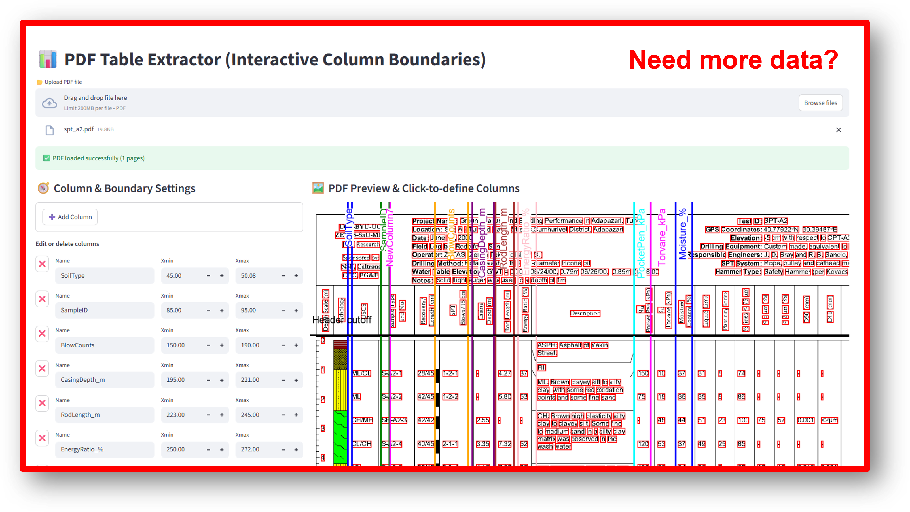

# 🧱 Geotechnical Borelog Digitizer — *PDF Table Extractor (Interactive GUI)*



---

## 📘 Overview

> An interactive Streamlit app for visually defining and extracting tabular data from geotechnical borelogs or other structured-but-inconsistently-formatted PDFs.

**Geotechnical Borelog Digitizer** helps convert complex borelog PDFs into clean, structured data — **without needing fixed templates or OCR-heavy workflows.**

This tool provides a **visual interface** where you can:

* Define column boundaries by clicking directly on the PDF.
* Adjust, rename, and delete columns dynamically.
* Set header/footer cutoff regions to exclude unwanted areas.
* Extract data from single or multiple pages into Excel format.

It’s particularly useful for **SPT logs, field sheets, or borehole records** where the text is digital yet **not arranged in consistent columns**, causing parsing errors in typical PDF tools.

---

## ✨ Key Features

| Feature                                      | Description                                                           |
| -------------------------------------------- | --------------------------------------------------------------------- |
| 🖱️ **Interactive Column Creation**          | Click on the PDF to define column ranges (xmin/xmax).                 |
| 🧭 **Column Management**                     | Rename, delete, or manually edit column boundaries.                   |
| 📏 **Header/Footer Cutoffs**                 | Ignore fixed regions such as titles, legends, or notes.               |
| 📄 **Page Navigation**                       | Quickly switch between pages with buttons or number input.            |
| ⚙️ **Data Extraction**                       | Export current or all pages to `.xlsx`.                               |
| 🖼️ **PDF Visualization**                    | Shows all column lines and cutoff markers directly on the page image. |
| 🔍 **Optional Click-to-Coordinates Support** | Uses `streamlit-image-coordinates` for interactive clicks.            |

---

## 🧰 Installation

Make sure you have **Python 3.9+** installed, then install the required packages:

```bash
pip install streamlit streamlit-image-coordinates pdfplumber pandas openpyxl pillow
```

---

## 🚀 How to Run (via Command Prompt)

1. **Navigate to your project folder**
   Example (Windows):

   ```bash
   cd "C:\Users\YourName\Desktop\Borelog_GUI"
   ```

2. **Run the Streamlit app:**

   ```bash
   streamlit run pdf_table_extractor_gui_04.py
   ```

3. After running the above command, Streamlit will automatically start a local web server.
   You’ll see something like this in your Command Prompt:

   ```bash
   You can now view your Streamlit app in your browser.

   Local URL: http://localhost:8501
   Network URL: http://192.168.x.x:8501
   ```

4. **Open your browser** (it usually opens automatically) and go to:
   👉 [http://localhost:8501](http://localhost:8501)

5. **Upload your test PDF** (for example, `spt_a1.pdf` included in this repo) and start using the app.

---

## 🧪 Test File

A sample file **`spt_a1.pdf`** is included in this repository.
It demonstrates a typical borelog layout with **aligned but inconsistently spaced digital text columns**.

---

## 🧱 Example Workflow

1. Upload **`spt_a1.pdf`**
2. Use the **click tool** to set left/right boundaries of each column.
3. Rename columns (e.g., *Soil Type*, *Depth*, *SPT N*, *Moisture %*).
4. Adjust **header/footer cutoffs** to trim noise.
5. Click **Extract Current Page** or **Extract All Pages**.
6. Download your **structured Excel file. ✅**

---

## 🧩 Directory Structure

```
📂 Geotechnical-Borelog-Digitizer
 ├── pdf_table_extractor_gui_04.py      # Main Streamlit app
 ├── spt_a1.pdf                         # Example test file
 ├── assets/
 │    └── demo_preview.png              # Optional screenshots for README
 └── README.md
```

---

## 💡 Tips

* The **click-to-define** feature is optional but highly recommended.
  Install it via:

  ```bash
  pip install streamlit-image-coordinates
  ```
* If your **column labels** overlap, adjust the label background thickness in the code (search for `# Draw vertical (rotated) label`).
* Use higher DPI PDFs for sharper previews.
* Keep the Command Prompt open while Streamlit is running — closing it will stop the app.

---

## 🧠 Roadmap / TODOs

* [ ] Add thicker semi-transparent backgrounds behind column labels.
* [ ] Optimize performance when defining many columns.
* [ ] Add export options for CSV/JSON/AGS4.
* [ ] Improve multi-page extraction preview.

---

## 📜 License

This project is released under the **MIT License** — feel free to use, modify, and distribute it.

---

## 🧑‍💻 Author

**Ali Yaz**  
📅 *October 2025*  
📫 Contact: [ali.yaz@student.tugraz.at](mailto:ali.yaz@student.tugraz.at)

---


> 💬 “Turning messy borelogs into structured data — one click at a time.”

---

